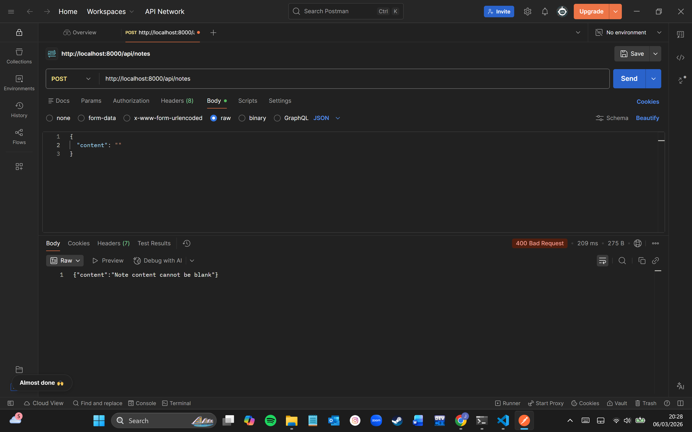
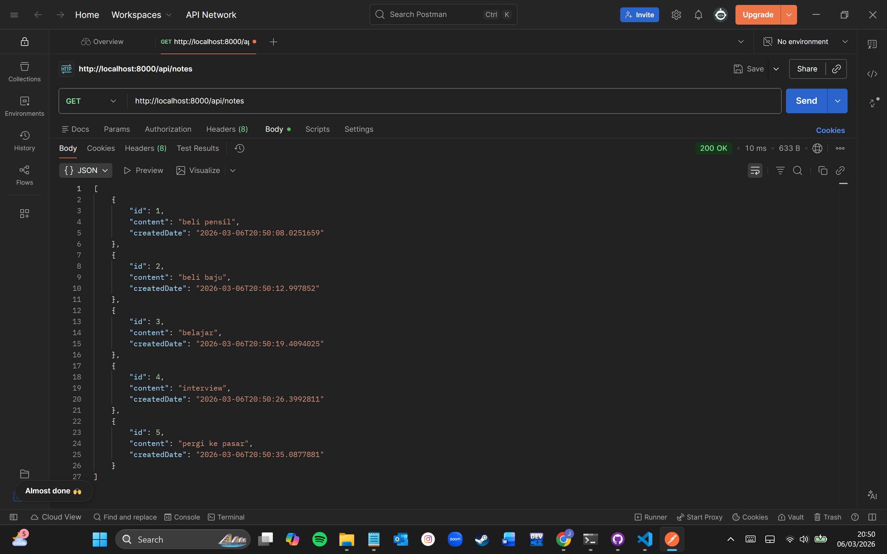
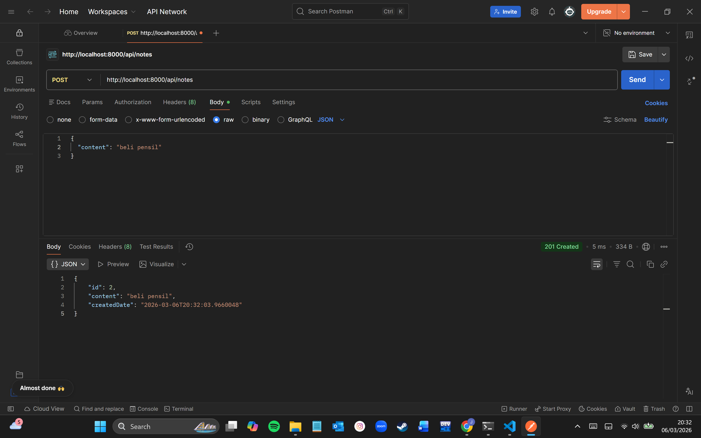
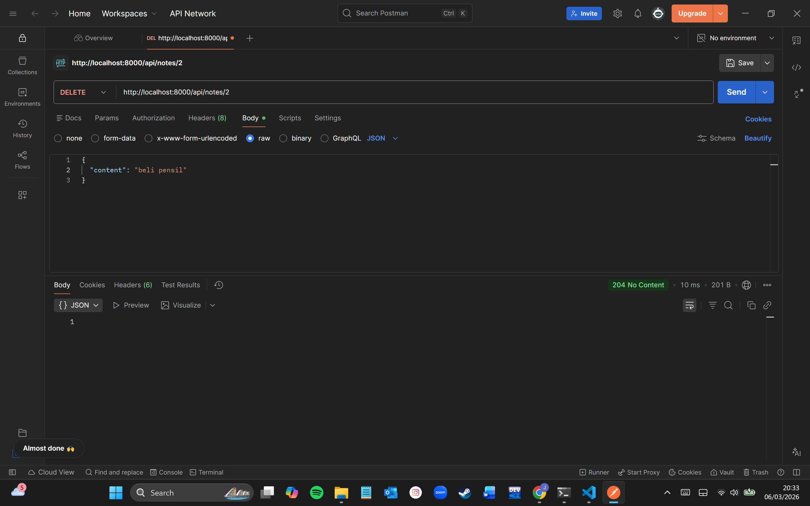
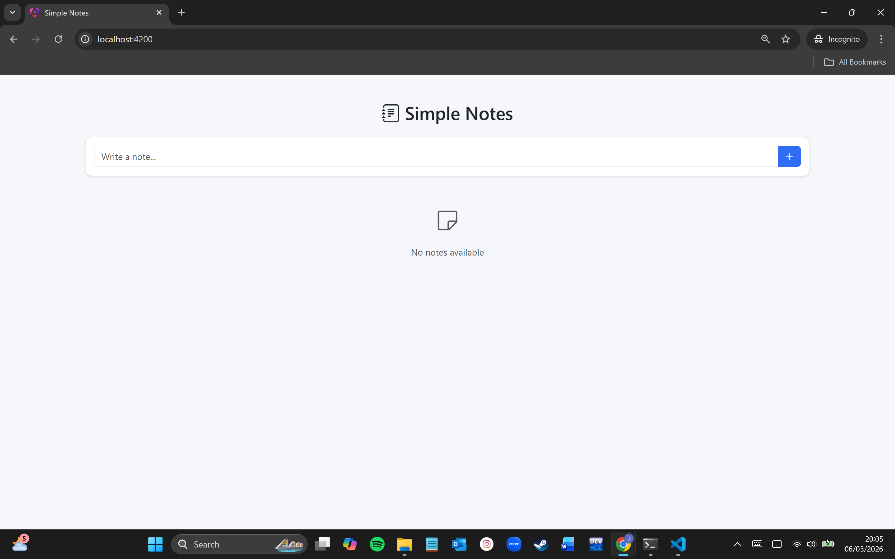
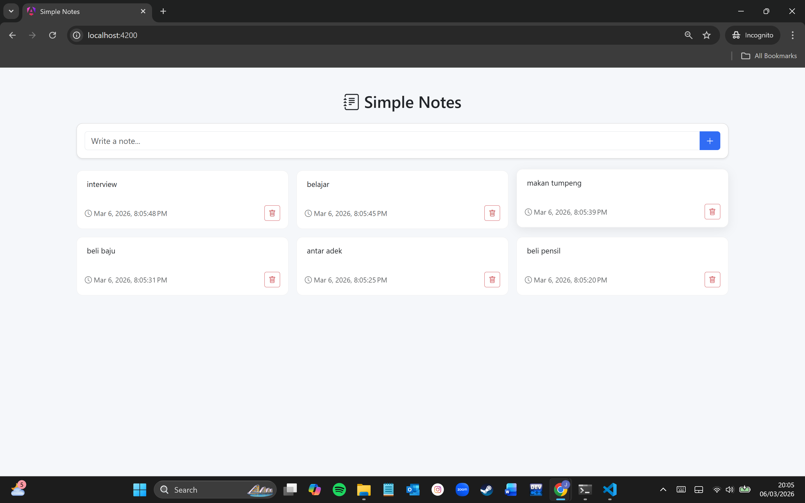

# Simple Notes Application

A simple notes application built with Spring Boot (backend) and Angular (frontend).
This application allows users to create, view, and delete notes. All notes are stored temporarily in memory without using an external database.

---

## Tech Stack

Backend
- Java
- Spring Boot

Frontend
- Angular
- Bootstrap

---

## API Endpoints

Method | Endpoint | Description
GET | /api/notes | Retrieve all notes
POST | /api/notes | Create a new note
DELETE | /api/notes/{id} | Delete a note

---

## How to Run

Run Backend

mvn spring-boot:run

Backend server will run on:

http://localhost:8000

---

Run Frontend

npm install
ng serve

Open the application at:

http://localhost:4200

---

## Screenshots

Validation Execution  
Example of validation when submitting an empty note.

---

API Details (Postman)

Get Notes

Create Note

Delete Note

---

Empty Notes Page

Display when there are no notes in the application.

---

Notes List

Example display when notes exist.

---

## Notes

- Data is stored in memory, so notes will reset when the backend server restarts.
- The application implements RESTful API principles and basic clean coding practices.